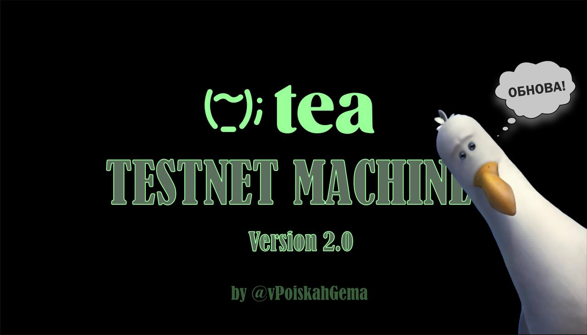

# 🌱 Автоматизация создания аккаунтов в TEA V2.0

Данный софт автоматически создает аккаунты в TEA, проявляет активности и зарабатывает награды!

## ⚙️ Обновление V2.0
- Добавлена возможность указания реферальной ссылки
- Добавлена установка 2FA для аккаунта
- Точечные фиксы и дополнения

## ⚙️ ВАЖНО
- В случае, если софт отрабатывает неправильно, вы всегда можете заглянуть в код и пофиксить это место!
Это очень просто:
1. Поймите, где происходит ошибка
2. Найдите соответсвующий модуль в папке modules
3. Перейдите в файл .py и найдите по комментариям строку с ошибкой (возможно неверно указан XPATH и скрипт неможет кликнуть/выполнить проверку наличия элемента)
4. Попробуйте закомментировать блок с проверкой или обновить XPATH элемента
5. Вы не только научитесь осуществлять навигацию в коде, но и сможете подстраивать софт для себя, а в будущем и самостоятельно писать свой код!

## ⚙️ Основные особенности
- Поддержка мобильной прокси
- Подмена useragent
- Сохранение персонального useragent для каждого аккаунта
- Скрытие использования средств автоматизации (антидетект)
- Восстановление доступа к почте по резервному почтовому ящику

## 🧩 Модули
- Создание аккаунта с помощью почты Gmail
- Генерация username для аккаунта
- Сохранение приватного ключа
- Указание почты для уведомлений и уровня знаний в настройках
- Отправка TEA в стейкинг к рандомному валидатору на случайную сумму
- Вывод случайной суммы из стейкинга
- Донат случайному валидатору
- Получение наград за стейкинг
- Получение статистики аккаунта

## 🛠️ Запуск софта
1. Скачайте проект
2. Запустите команду `pip install -r requirements.txt`
3. Все настройки находятся в `config.py`
4. Заполните файл `mails.txt`, построчно указывая данные почт в формате: `mail.@gmail.com:password:reservemail@gmail.com`
5. Запустите софт командой `py main.py`

## ♾️ Подробное описание файлов

**config.py**  
Содержит параметры конфигурации, такие как прокси, ссылки для смены IP, задержки и прочее.

**database.py**  
Управляет взаимодействием с базой данных, включая создание базы, сохранение данных и получение аккаунтов.

**functions.py**  
Включает вспомогательные функции, такие как генерация username, смена IP и получение количества points.

**main.py**  
Основной файл, который содержит логику выполнения маршрута, используя функции из других файлов.

**Папка modules**  
Содержит файлы с маршрутами для каждого модуля.

**valid_logins_to_ref.py**  
Скрипт для получения списка рефералок из валидных логинов.

## ❔ ПОЛНАЯ ИНСТРУКЦИЯ
- [teletype.in/@vpoiskahgema/tea-machine]([https://t.me/vpoiskahgema](https://teletype.in/@vpoiskahgema/tea-machine)) - читаем

## ❔ Куда писать свой вопрос?
- [@vpoiskahgema](https://t.me/vpoiskahgema) - мой канал в Telegram
- [@vpoiskahchata](https://t.me/vpoiskahchata) - чат для вопросов и пожеланий
